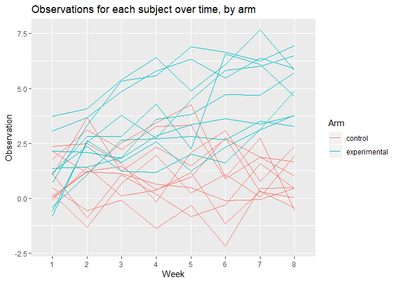

p8105\_HW5\_rat2134
================
Robert Tumasian
11/3/2019

``` r
#Load required packages
library(tidyverse)
```

# Homework 5

## Problem 1

``` r
#Loading data
set.seed(10)

iris_with_missing = iris %>% 
  map_df(~replace(.x, sample(1:150, 20), NA)) %>%
  mutate(Species = as.character(Species))
```

``` r
#Function
problem_1_function = function(x) {
  
  if (is.numeric(x)) {
    ifelse(is.na(x), mean(x, na.rm = TRUE), x)
  } else if (is.character(x)){
    ifelse(is.na(x), "virginica", x)
  }

}
```

``` r
#Applying function to each column of 'iris_with_missing' using 'map'
iris_without_missing = map(iris_with_missing, problem_1_function)
```

## Problem 2

``` r
#Load data
longitudinal_data = map_df(.x = list.files("./hw5_data"), 
                            ~ read_csv(str_c("./hw5_data\\", .x)))
longitudinal_data
```

    ## # A tibble: 20 x 8
    ##    week_1 week_2 week_3 week_4 week_5 week_6 week_7 week_8
    ##     <dbl>  <dbl>  <dbl>  <dbl>  <dbl>  <dbl>  <dbl>  <dbl>
    ##  1   0.2  -1.31    0.66   1.96   0.23   1.09   0.05   1.94
    ##  2   1.13 -0.88    1.07   0.17  -0.83  -0.31   1.58   0.44
    ##  3   1.77  3.11    2.22   3.26   3.31   0.89   1.88   1.01
    ##  4   1.04  3.66    1.22   2.33   1.47   2.7    1.87   1.66
    ##  5   0.47 -0.580  -0.09  -1.37  -0.32  -2.17   0.45   0.48
    ##  6   2.37  2.5     1.59  -0.16   2.08   3.07   0.78   2.35
    ##  7   0.03  1.21    1.13   0.64   0.49  -0.12  -0.07   0.46
    ##  8  -0.08  1.42    0.09   0.36   1.18  -1.16   0.33  -0.44
    ##  9   0.08  1.24    1.44   0.41   0.95   2.75   0.3    0.03
    ## 10   2.14  1.15    2.52   3.44   4.26   0.97   2.73  -0.53
    ## 11   3.05  3.67    4.84   5.8    6.33   5.46   6.38   5.91
    ## 12  -0.84  2.63    1.64   2.58   1.24   2.32   3.11   3.78
    ## 13   2.15  2.08    1.82   2.84   3.36   3.61   3.37   3.74
    ## 14  -0.62  2.54    3.78   2.73   4.49   5.82   6      6.49
    ## 15   0.7   3.33    5.34   5.57   6.9    6.66   6.24   6.95
    ## 16   3.73  4.08    5.4    6.41   4.87   6.09   7.66   5.83
    ## 17   1.18  2.35    1.23   1.17   2.02   1.61   3.13   4.88
    ## 18   1.37  1.43    1.84   3.6    3.8    4.72   4.68   5.7 
    ## 19  -0.4   1.08    2.66   2.7    2.8    2.64   3.51   3.27
    ## 20   1.09  2.8     2.8    4.3    2.25   6.57   6.09   4.64

``` r
#Tidy data
longitudinal_data_tidy = 
  longitudinal_data %>%
    mutate(id = 1:20,
           arm = c(rep("control", 10), rep("experimental", 10))) %>%
    pivot_longer(week_1:week_8, 
                 names_to = "week", 
                 values_to = "observation") %>%
    mutate(week = str_replace(string = week,
                              pattern = ".*_",
                              replacement = ""))
```

``` r
#Spaghetti plot
longitudinal_data_tidy %>%
  ggplot(aes(x = week, y = observation, group = id, color = arm)) +
  geom_line() +
  labs(
    title = "Observations for each subject over time, by arm",
    x = "Week",
    y = "Observation",
    color = "Arm"
  )
```

<!-- -->

Overall, we can see that subjects in the experimental arm have higher
observation values over time compared to subjects in the control arm. At
8 weeks, all subjects in the control group have lower observation values
than those in the experimental group.

## Problem 3

``` r
#Set design elements
n = 30
```
