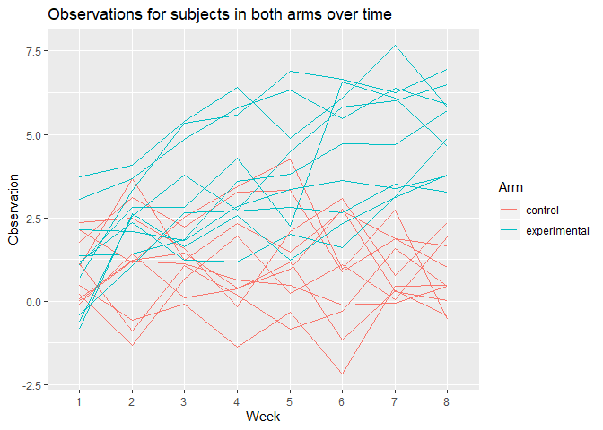

p8105\_HW5\_rat2134
================
Robert Tumasian
11/3/2019

``` r
#Load required packages
library(tidyverse)
library(broom)
```

# Homework 5

## Problem 1

``` r
#Loading data
set.seed(10)

iris_with_missing = iris %>% 
  map_df(~replace(.x, sample(1:150, 20), NA)) %>%
  mutate(Species = as.character(Species))
```

``` r
#Function
problem_1_function = function(x) {
  
  if (is.numeric(x)) {
    ifelse(is.na(x), mean(x, na.rm = TRUE), x)
  } else if (is.character(x)){
    ifelse(is.na(x), "virginica", x)
  }

  x
  
}
```

``` r
#Applying function to each column of 'iris_with_missing' using 'map'
iris_without_missing = map(iris_with_missing, problem_1_function)

is.na(iris_without_missing)
```

    ## Sepal.Length  Sepal.Width Petal.Length  Petal.Width      Species 
    ##        FALSE        FALSE        FALSE        FALSE        FALSE

There are no longer any missing values in the columns after applying
`problem_1_function` to the `iris_with_missing` dataset.

## Problem 2

``` r
#Load data
longitudinal_data = map_df(.x = list.files("./hw5_data"), 
                            ~ read_csv(str_c("./hw5_data\\", .x)))
longitudinal_data
```

    ## # A tibble: 20 x 8
    ##    week_1 week_2 week_3 week_4 week_5 week_6 week_7 week_8
    ##     <dbl>  <dbl>  <dbl>  <dbl>  <dbl>  <dbl>  <dbl>  <dbl>
    ##  1   0.2  -1.31    0.66   1.96   0.23   1.09   0.05   1.94
    ##  2   1.13 -0.88    1.07   0.17  -0.83  -0.31   1.58   0.44
    ##  3   1.77  3.11    2.22   3.26   3.31   0.89   1.88   1.01
    ##  4   1.04  3.66    1.22   2.33   1.47   2.7    1.87   1.66
    ##  5   0.47 -0.580  -0.09  -1.37  -0.32  -2.17   0.45   0.48
    ##  6   2.37  2.5     1.59  -0.16   2.08   3.07   0.78   2.35
    ##  7   0.03  1.21    1.13   0.64   0.49  -0.12  -0.07   0.46
    ##  8  -0.08  1.42    0.09   0.36   1.18  -1.16   0.33  -0.44
    ##  9   0.08  1.24    1.44   0.41   0.95   2.75   0.3    0.03
    ## 10   2.14  1.15    2.52   3.44   4.26   0.97   2.73  -0.53
    ## 11   3.05  3.67    4.84   5.8    6.33   5.46   6.38   5.91
    ## 12  -0.84  2.63    1.64   2.58   1.24   2.32   3.11   3.78
    ## 13   2.15  2.08    1.82   2.84   3.36   3.61   3.37   3.74
    ## 14  -0.62  2.54    3.78   2.73   4.49   5.82   6      6.49
    ## 15   0.7   3.33    5.34   5.57   6.9    6.66   6.24   6.95
    ## 16   3.73  4.08    5.4    6.41   4.87   6.09   7.66   5.83
    ## 17   1.18  2.35    1.23   1.17   2.02   1.61   3.13   4.88
    ## 18   1.37  1.43    1.84   3.6    3.8    4.72   4.68   5.7 
    ## 19  -0.4   1.08    2.66   2.7    2.8    2.64   3.51   3.27
    ## 20   1.09  2.8     2.8    4.3    2.25   6.57   6.09   4.64

``` r
#Tidy data
longitudinal_data_tidy = 
  longitudinal_data %>%
    mutate(id = 1:20,
           arm = c(rep("control", 10), rep("experimental", 10))) %>%
    pivot_longer(week_1:week_8, 
                 names_to = "week", 
                 values_to = "observation") %>%
    mutate(week = str_replace(string = week,
                              pattern = ".*_",
                              replacement = ""))

#Snapshot of data after tidying
head(longitudinal_data_tidy, 20)
```

    ## # A tibble: 20 x 4
    ##       id arm     week  observation
    ##    <int> <chr>   <chr>       <dbl>
    ##  1     1 control 1            0.2 
    ##  2     1 control 2           -1.31
    ##  3     1 control 3            0.66
    ##  4     1 control 4            1.96
    ##  5     1 control 5            0.23
    ##  6     1 control 6            1.09
    ##  7     1 control 7            0.05
    ##  8     1 control 8            1.94
    ##  9     2 control 1            1.13
    ## 10     2 control 2           -0.88
    ## 11     2 control 3            1.07
    ## 12     2 control 4            0.17
    ## 13     2 control 5           -0.83
    ## 14     2 control 6           -0.31
    ## 15     2 control 7            1.58
    ## 16     2 control 8            0.44
    ## 17     3 control 1            1.77
    ## 18     3 control 2            3.11
    ## 19     3 control 3            2.22
    ## 20     3 control 4            3.26

``` r
#Spaghetti plot
longitudinal_data_tidy %>%
  ggplot(aes(x = week, y = observation, group = id, color = arm)) +
  geom_line() +
  labs(
    title = "Observations for subjects in both arms over time",
    x = "Week",
    y = "Observation",
    color = "Arm"
  )
```

<!-- -->

We can see that subjects in the experimental arm tend to have higher
observation values over time compared to subjects in the control arm. At
8 weeks, all subjects in the control group have lower observation values
than those in the experimental group.

## Problem 3

``` r
set.seed(142)

regression_simulation = function(n = 30, beta_0 = 2, beta_1) {
  
  simulation_data = tibble(
    x = rnorm(n, mean = 0, sd = 1),
    y = beta_0 + beta_1 * x + rnorm(n, 0, sqrt(50))
  )
  
  ls_fit = lm(y ~ x, data = simulation_data)

  broom::tidy(ls_fit)[2, c(2,5)]

}
```

``` r
#Generating 10,000 datasets from simple linear model for beta_1 = 0
simulation_results = 
  rerun(10000, regression_simulation(30, 2, 0)) %>% 
  bind_rows()
```

``` r
#Repeat dataset generation using beta_1 = 1,2,3,4,5,6
simulation_results_2 = 
  tibble(beta_1 = c(1:6)) %>% 
  mutate(
    output_lists = map(.x = beta_1, 
                       ~rerun(10000, regression_simulation(beta_1 = .x))),
    estimate_dfs = map(output_lists, bind_rows)) %>% 
  select(-output_lists) %>% 
  unnest(estimate_dfs)
```

``` r
#Plot showing the proportion of times the null was rejected
simulation_results_2 %>%
  group_by(beta_1) %>%
  summarize(sig_p_values = length(which(p.value < 0.05))) %>%
  ggplot(aes(x = beta_1, y = sig_p_values/10000)) +
  geom_bar(stat = "identity") +
  scale_x_discrete(limit = c("1", "2", "3", "4", "5", "6")) +
  labs(
    title = "Proportion of times the null was rejected with increasing effect size",
    x = "Effect Size",
    y = "Proportion of times the null was rejected"
  )
```

<!-- -->

We can see that as effect size increases, the proportion of times the
null was rejected, or the power, also increases, suggesting that effect
size and power are positively associated.

``` r
#Plot showing average estimated effect size vs. true effect size
simulation_results_2 %>%
  group_by(beta_1) %>%
  summarize(avg_beta_1_estimate = mean(estimate),
            avg_beta_1_estimate_null_rejected = 
              mean(estimate[which(p.value < 0.05)])) %>%
  ggplot(aes(x = beta_1)) +
  geom_line(aes(y = avg_beta_1_estimate, color = "Total"), 
            size = 1) +
  geom_line(aes(y = avg_beta_1_estimate_null_rejected, color = "Null Rejected"), 
            size = 1) +
  scale_x_discrete(limit = c("1", "2", "3", "4", "5", "6")) +
  scale_color_discrete(name = "Results") +
  labs(
    title = "Average estimated effect size vs. true effect size",
    x = "True Effect Size",
    y = "Average Estimated Effect Size")
```

<!-- -->

As the true effect size moves away from zero, the average estimated
effect size across tests for which the null was rejected approaches the
true effect size. This is because more tests will reject the null as
effect size increases. In addition, the average estimated effect size is
strictly greater than the true effect size, because the average
estimated effect size is calculated using only the effect sizes that are
greater than zero.
